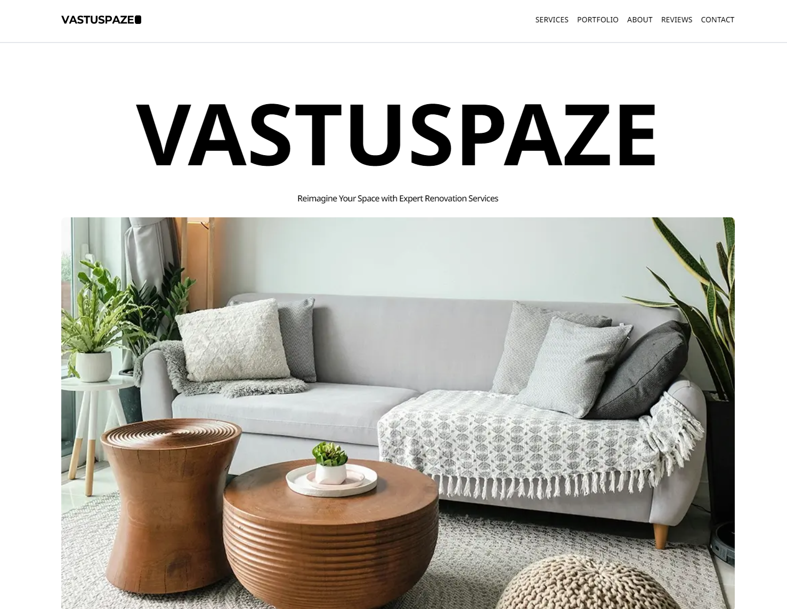

# Renovation Company landing page React + vite

this is a practice project to make a static web app with react and learn more about components and use them.

### Techno used:

- vite
- React
- TailwindCSS
- postcss
- deployed in Vercel

### Description

one page app which contain :

- hero section (introduction)
- services section (display all services company provide)
- Portfolio section (display designs created by company)
- About section (give info about company)
- Reviews section (display reviews given by clients)
- contact section (contact info)

### Live link [Click](https://renovation-react.vercel.app/)

### LightHouse Score:

### screen shot:

